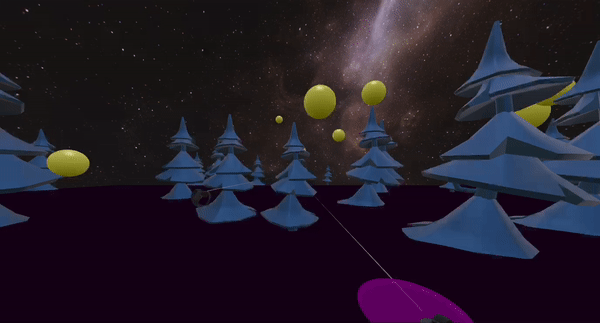

# Frisbee VR

This is a prototype of a game of throwing frisbee in VR.
It runs in browser using WebXR (BabylonJS).

Right now in order to use it you must have any VR headset with controllers like Oculus Quest.
There might be version to use without VR headset in future.


## Build: 
```
npm run build
```

## Run:
Copy `src/static/*` to `dist/`

Open `dist/index.html` in browser

## Run dev-server
Instead of building manually and reloading everything, it's convenient to use a dev-server
```
npm start
```

## Model

[FrisPy](https://github.com/tmcclintock/FrisPy) library has been used in order to calculate a frisbee flight trajectory
